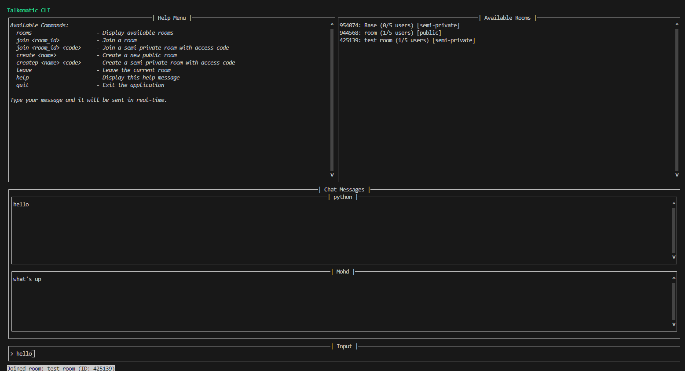

# Talkomatic CLI

A command-line interface (CLI) chat application inspired by the classic Talkomatic. This CLI allows users to connect to a Socket.IO server, join chat rooms, and communicate in real-time with other users.



This is a CLI for Talkomatic Classic Edition, created by Mohd Mahmodi ([@mohdmahmodi](https://x.com/mohdmahmodi)). 

Talkomatic Classic is a rebuilt open source version of the original Talkomatic system.

## Table of Contents

[previous sections remain the same...]

## Installation

### Prerequisites

- Python 3.7 or higher
- `pip` package manager

### Installing Dependencies

Install all required Python packages using `pip`:

```bash
pip install python-socketio aiohttp prompt_toolkit click asyncio
```

Or install them individually:

```bash
pip install python-socketio  # Socket.IO client functionality
pip install aiohttp         # Required by python-socketio
pip install prompt_toolkit  # Interactive CLI interface
pip install click          # Command line argument parsing
pip install asyncio        # Async/await functionality
```

### Running the Application

Clone the repository and navigate to the project directory. Then, run the application using:

```bash
python app.py
```

You will be prompted to enter your username and location:

```
Enter your username: <Your Username>
Enter your location [On The Web]:
```

## Usage

Once the application is running, you will see a user interface divided into several sections:

- **Help Menu**: Displays available commands
- **Available Rooms**: Lists current chat rooms
- **Chat Messages**: Shows the chat conversation
- **Input Field**: Type commands or messages here
- **Status Bar**: Displays connection and status messages

### Commands

Type the following commands in the input field to interact with the application:

- `rooms`: Display a list of available rooms
- `join <room_id>`: Join a room by its ID
- `join <room_id> <access_code>`: Join a semi-private room using an access code
- `create <room_name>`: Create a new public room with the specified name
- `createp <room_name> <access_code>`: Create a new semi-private room with an access code
- `leave`: Leave the current room
- `help`: Display the help menu with available commands
- `quit`: Exit the application

**Note**: You can also type your messages directly in the input field when in a chat room. Messages are sent in real-time.

## Code Overview

### Architecture

The application uses the `prompt_toolkit` library to create a text-based user interface. It connects to a Socket.IO server to handle real-time communication.

### Key Components

- **TalkomaticCLI Class**: Main class that initializes the application, sets up the UI, and handles Socket.IO events
- **Socket.IO Client**: Manages real-time communication with the server
- **UI Components**: Uses `HSplit`, `VSplit`, `TextArea`, `Label`, and `Frame` from `prompt_toolkit` to create the layout
- **Event Handling**: Asynchronous functions handle events like connecting to the server, receiving messages, and updating the UI
- **Command Parsing**: Regular expressions are used to parse user commands from the input field

#### Important Methods

- `setup_socket_events()`: Registers event handlers for Socket.IO events
- `create_ui()`: Builds the user interface layout
- `handle_user_input(user_input)`: Processes commands entered by the user
- `update_room_list()`: Updates the list of available rooms in the UI
- `get_chat_area()`: Constructs the chat messages area dynamically
- `send_chat_update(message)`: Sends the user's message to the server

## License

This project is open-source and available under the MIT License.

## Acknowledgments

- Inspired by the original Talkomatic created by Doug Brown and David R. Woolley in 1973
- Built using the prompt_toolkit library
- Real-time communication powered by Socket.IO
- Special thanks to Mohd Mahmodi for creating Talkomatic Classic Edition